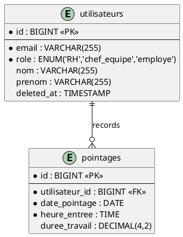
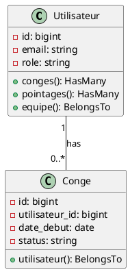
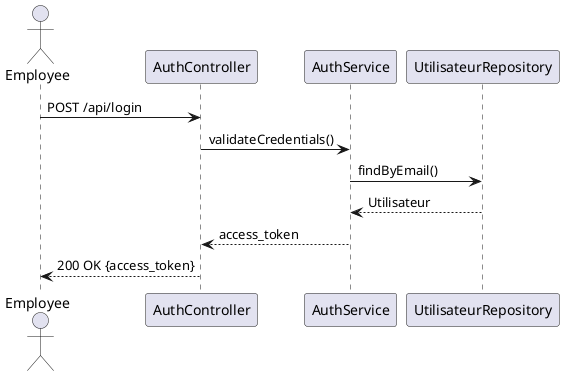

# LaTeX FYP Report Writer for TacTic (with PlantUML Diagrams)

A skill for helping write the TacTic HR platform final year project report in LaTeX where
diagrams are PlantUML code that must accurately reflect the real project:
Laravel backend models, database tables/relations, API/routes, React frontend structure, and FastAPI AI service.

The single most important rule of this skill:

> **Never invent a diagram from general knowledge of "what a typical app looks
> like." Every entity, field, relation, class, or flow in a diagram must be
> traceable to something that actually exists in the TacTic project.**

If the project source isn't available or isn't clear, ask the user for it or
for the missing piece — don't guess an entity, field type, or relation.

---

## 0. Figure out what you're working with

Before writing anything, establish:

1. **Where is the TacTic project code?** The project structure is:
   - `backend/` — Laravel 10 REST API (PHP 8.2, JWT auth, PostgreSQL on port 5433)
   - `frontend/` — React 18 + TypeScript SPA
   - `ai-service/` — FastAPI + PyTorch (Python 3.9)
   - Inspect these directories directly for models, migrations, routes, and services.

2. **Where is the report?** The LaTeX report is in `Report/` with chapters:
   - `chap_01.tex` — Introduction
   - `chap_02.tex` — Literature Review / Related Work
   - `chap_03.tex` — Release 1 (Sprint 1 & 2: Authentication, User Management, Attendance)
   - `chap_04.tex` — Release 2 (Sprint 3 & 4: Leave Management, Payroll)
   - `chap_05.tex` — Release 3 (Sprint 5 & 6: Recruitment, AI & Analytics)
   
   Read the current structure (`\input`/`\include` graph, existing packages, bibliography style)
   before adding anything, so new content matches existing conventions.

3. **What diagram(s) are needed right now?** Don't generate every diagram
   type up front — figure out which chapter/section prompted the request
   (e.g. "System Design" chapter → architecture + ER diagram; "Implementation"
   chapter → class diagram; a specific feature → sequence diagram).

4. **Where are existing UML diagrams?** The `UML/` directory contains:
   - `release1/` — Sprint 1 & 2 diagrams (use case, authentication, check-in, attendance sequences)
   - `release2/` — Sprint 3 & 4 diagrams (use case, leave request, approve leave, payroll sequences)
   - `release3/` — Sprint 5 & 6 diagrams (use case, job matching, AI sequences)
   - `sprint3/` — Legacy Sprint 3-only diagrams
   
   Check existing diagrams before creating new ones to maintain consistency.

If more than one of these is ambiguous or missing, ask one focused question
rather than guessing on all fronts at once.

---

## 1. Extracting ground truth from the TacTic project

Diagrams must be built from evidence, not assumption. Use this priority order
per diagram type:

### Database / ER diagrams
Look for, in this order of preference:
- Migration files in `backend/database/migrations/` (Laravel migrations)
- ORM model classes in `backend/app/Models/` (Eloquent models with relationships)
- Schema definition from actual database connection (PostgreSQL on port 5433, database: `tactic_db`)

**Key tables to verify:**
- `utilisateurs` — users with soft deletes (`deleted_at`), roles: RH, chef_equipe, employe
- `pointages` — attendance records with `duree_travail` decimal(4,2) NOT NULL DEFAULT 0
- `conges` — leave requests with status workflow
- `paies` — payroll records with decimal(10,2) monetary amounts
- `equipes`, `postes`, `affectations` — team and position management
- `competences`, `utilisateur_competence` — skills management
- `job_posts`, `job_applications`, `ai_recommendations` — recruitment module

Extract: table names, column names, types, primary keys, foreign keys,
nullability, and the cardinality of each relation (1:1, 1:N, M:N — check for a
join table). Do not assume standard field names like `id`/`created_at` exist
unless you saw them in the migrations.

### Class diagrams (backend models / domain layer)
- Read the actual Eloquent model classes in `backend/app/Models/`
- Capture real attributes and methods (public methods only, unless the user wants internals)
- Capture real relationships: `hasMany()`, `belongsTo()`, `belongsToMany()`, etc.
- Include visibility (`+`/`-`/`#`) only if it's determinable from PHP visibility modifiers

### Sequence / use case diagrams
- Trace actual code paths: controller in `backend/app/Http/Controllers/` → service in `backend/app/Services/` → repository/DB call → response
- Use real function/endpoint names from `backend/routes/api.php` (all routes under `/api/`)
- For use case diagrams, base actors and use cases on real auth roles (`RH`, `chef_equipe`, `employe`)
- Reference existing sequence diagrams in `UML/release1/`, `UML/release2/`, `UML/release3/` for style consistency

### Architecture diagrams
- Base components on the actual 3-service architecture:
  - Laravel backend (port 8000) — REST API with JWT auth
  - React frontend (port 3000) — SPA calling backend at `http://127.0.0.1:8000/api`
  - FastAPI AI service (port 8001) — PyTorch models, called via Laravel proxy at `/api/ai/...`
- Check `docker/` for deployment config if available
- Reference the README architecture notes if present

**After drafting a diagram, do a verification pass**: reread the source files
and check every element in the diagram against them one more time before
handing it to the user. State briefly which files each diagram was derived from.

---

## 2. Writing correct PlantUML

Use standard PlantUML syntax so it renders in any PlantUML tool (VS Code
extension, plantuml.com, `plantuml.jar`, Overleaf's `plantuml` package, etc.).

**Follow the existing diagram style in `UML/`:**
- Use `skinparam packageStyle rectangle` and `skinparam actorStyle awesome`
- Use `left to right direction` for use case diagrams
- Include descriptive titles: `title Release X — [Module Name]`
- Use inheritance for actors: `Emp <|-- Chef <|-- RH`

**ER diagram skeleton (crow's-foot notation):**


**Class diagram skeleton (Laravel models):**


**Sequence diagram skeleton (Laravel API flow):**


Rules to follow every time:
- One `@startuml`/`@enduml` block per diagram, no stray text inside.
- Use consistent, real naming (match actual table/class/endpoint names —
  case included, e.g. `utilisateurs` not `users`).
- Prefer crow's-foot-style relations (`||--o{`, `}o--||`) for ER diagrams so
  cardinality is explicit and correct — double check 1:N vs M:N against the
  actual foreign keys / join tables in migrations.
- Keep diagrams scoped: a full-schema ER diagram with 20 tables belongs in an
  appendix; a chapter body diagram should show only the entities relevant to
  that section. Ask the user which scope they want if unclear.
- Match the visual style of existing diagrams in `UML/release1/`, `UML/release2/`, `UML/release3/`.

---

## 3. Getting PlantUML into the LaTeX document

The TacTic report uses **Option A** — render to image, `\includegraphics`:

```latex
\begin{figure}[H]
    \centering
    \IfFileExists{images/Release2 Use Case.drawio.png}{%
    \frame{\includegraphics[width=0.85\columnwidth]{images/Release2 Use Case.drawio.png}}%
    }{%
    \fbox{\parbox{0.85\columnwidth}{\centering Diagram path: images/Release2 Use Case.drawio.png}}%
    }
    \caption{Use case diagram of Release 2 (Sprint 3 and Sprint 4).}
    \label{fig:release2-usecase}
\end{figure}
```

**Export workflow:**
1. Create/update `.puml` file in appropriate `UML/releaseX/` folder
2. Render using PlantUML JAR or node-plantuml (see `UML/README.md`)
3. Copy/rename generated PNG to `Report/images/` with the expected filename
4. Update the LaTeX figure block if the filename changed

**Example export command:**
```powershell
cd UML
java -jar plantuml.jar -tpng release1/*.puml release2/*.puml release3/*.puml
```

Keep the `.puml` source file alongside the rendered image so it's regenerable and
the user can request edits to the source rather than the image.

---

## 4. Report writing conventions for TacTic

When drafting or extending report prose (not just diagrams):

- **Match existing structure and style first.** Read the current chapter to match:
  - Heading depth (chapter → section → subsection)
  - Tense (passive/past for implemented work, present for ongoing description)
  - Citation style if any
  - Terminology (use "RH", "chef_equipe", "employe" — not generic "Admin/User")
  - French/English terminology consistency (the report uses mixed French/English)

- **Every diagram gets a caption, label, and at least one sentence of prose**
  referencing it by `\ref{}`/`\autoref{}` before or after — don't drop a
  figure in with no discussion.

- **Don't fabricate results, benchmarks, or evaluation numbers.** If a
  section needs data the user hasn't provided (test coverage, performance
  numbers, AI model accuracy), ask for it or mark it as a placeholder the user
  must fill in — flag placeholders clearly, e.g. `% TODO: insert actual
  model accuracy here`.

- **TacTic-specific terminology:**
  - Backend: Laravel 10, PHP 8.2, JWT auth, PostgreSQL (port 5433)
  - Frontend: React 18, TypeScript, Tailwind CSS
  - AI Service: FastAPI, PyTorch, Python 3.9
  - Roles: RH, chef_equipe, employe
  - Database: tactic_db, user: postgres, password: admin

- **Chapter structure:**
  - Chapter 3: Release 1 — Authentication, User Management, Attendance
  - Chapter 4: Release 2 — Leave Management, Payroll
  - Chapter 5: Release 3 — Recruitment, AI & Analytics

---

## 5. Workflow checklist for each diagram request

1. Identify which real source files the diagram must be based on (migrations, models, routes).
2. Read them from `backend/`, `frontend/`, or `ai-service/` directories.
3. Draft the PlantUML code using only entities/fields/relations found in step 2.
4. Re-check the draft against the source files line by line.
5. Place the `.puml` file in the appropriate `UML/releaseX/` folder.
6. Render the diagram and update the image in `Report/images/`.
7. Insert/update the `figure` block in the correct `.tex` file at the right location.
8. Tell the user briefly which source files were used, and flag anything you
  couldn't verify.

---

## 6. Common mistakes to avoid

- Guessing standard CRUD fields (`created_at`, `updated_at`, `deleted_at`)
  that don't actually exist in the user's schema — check migrations first.
- Drawing every table in one giant ER diagram when the section only discusses
  a subset — split into scoped diagrams per module.
- Mixing UML notations (e.g. ER crow's-foot notation inside a class diagram).
- Renaming entities to "sound better" instead of matching the
  codebase (e.g. "utilisateurs" → "users").
- Adding a diagram with no caption/label/reference in the surrounding text.
- Forgetting that the frontend never calls the AI service directly — all AI calls
  go through the Laravel proxy at `/api/ai/...`.
- Ignoring the existing diagram structure in `UML/release1/`, `UML/release2/`, `UML/release3/`.
- Using the wrong database port (5433, not the default 5432).
